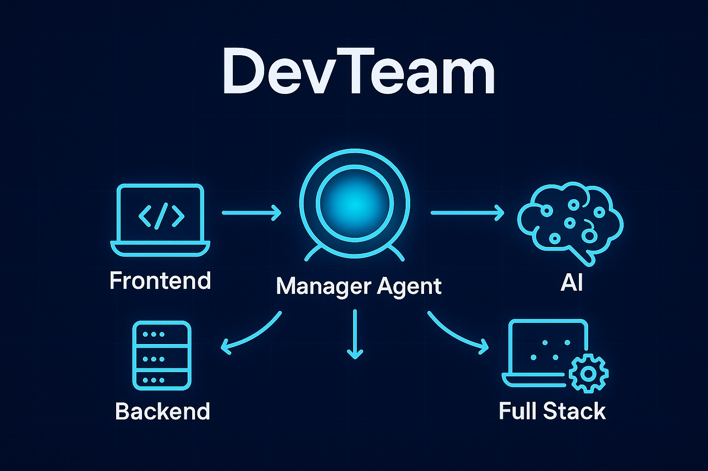

# DevTeam – AI-Powered Developer Team 👨‍💻🤖

<p align="center">
  
</p>

An **AI-powered developer assistant** built with [OpenAI Agents](https://github.com/openai/agents), [Chainlit](https://docs.chainlit.io/), and [Gemini API](https://ai.google.dev/).
It acts as a **multi-agent system** with specialized experts for **Frontend, Backend, AI, and Full Stack Development**, managed by a central **Manager Agent**.

The system includes **guardrails** for input and output validation to ensure domain relevance.

---

## 🚀 Features

* **Multi-Agent Setup**

  * Frontend Expert (React, CSS, JS, UI/UX)
  * Backend Expert (APIs, Databases, Server Architecture)
  * AI Expert (ML/DL, LLMs, Agents, RAG)
  * Full Stack Expert (Frontend + Backend + AI + DevOps)
* **Manager Agent** → Routes queries to the correct expert.
* **Guardrails** → Input & Output validation ensures responses stay domain-related.
* **Summarizer Agent** → Keeps conversations concise by summarizing long histories.
* **Interactive Chat UI** powered by Chainlit.


## **Installation**

### 1. Clone the repo

```bash
git clone https://github.com/hamzakamelen/dev-team.git
cd dev-team
```

### 2. Create virtual environment with `uv`

```bash
uv init .
uv add -r requirements.txt
```

Or manually install with pip:

```bash
pip install -r requirements.txt
```

### 3. Activate the environment

```bash
# Windows
.venv\Scripts\activate

# Linux / macOS
source .venv/bin/activate
```

---

## ⚙️ Environment Variables

Create a `.env` file in the project root:

```env
GEMINI_API_KEY=your_gemini_api_key_here
```

---

## ▶️ Running the Project

Run normally:

```bash
uv run app.py
```

Run with Chainlit UI:

```bash
uv run chainlit run app.py -w
```

Then open [http://localhost:8000](http://localhost:8000) to chat with your **AI Developer Team**.

---

## 📂 Project Structure

```
.
├── main.py              # Entry point (Chainlit handlers & chat flow)
├── dev_agents/          # Specialized agents (experts, manager, summarizer)
│   ├── __init__.py
│   ├── experts.py
│   ├── manager.py
│   ├── summarizer.py
│
├── guardrails/          # Input & Output guardrails
│   ├── __init__.py
│   ├── input_guardrail.py
│   ├── output_guardrail.py
│
├── utils/               # Helper functions & history utils
│   ├── __init__.py
│   ├── helpers.py
│
├── config/              # Project-wide settings
│   ├── __init__.py
│   ├── settings.py
│
├── requirements.txt     # Python dependencies
├── .env                 # API keys (ignored by git)
└── README.md            # Documentation
```

---

## 📋 Requirements

Dependencies are listed in `requirements.txt`. Main ones include:

* `python-dotenv` → Load environment variables
* `openai-agents` → Multi-agent orchestration
* `chainlit` → Chat UI
* `requests` → API calls

---

## 🎯 Usage

Once running, the chatbot greets you with:

> “Hi! 👋 Welcome to DevTeam - your AI-powered Developer Team.
> I can help you with:
>
> * Frontend Development
> * Backend Development
> * Artificial Intelligence
> * Full Stack Development”

Just ask a question, and the **Manager Agent** will route it to the correct expert.

---

## 🛡️ Guardrails

* **Input Guardrail** → Blocks irrelevant queries (e.g., unrelated to dev/AI).
* **Output Guardrail** → Ensures final response remains within supported domains.

---

## 🤝 Contributing

PRs are welcome! For major changes, open an issue first to discuss what you’d like to change.
